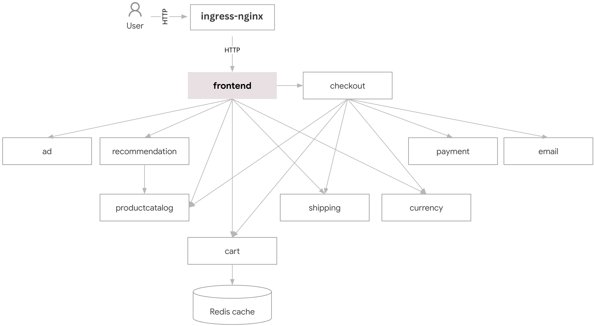

# Online Boutique Microservices Project



This project deploys an Online Boutique application consisting of various microservices that simulate an e-commerce platform. The architecture diagram above provides an overview of the microservices and their interactions.

## Project Overview

The Online Boutique application is built using multiple microservices, each responsible for different functionalities of an e-commerce platform. Below is a list of the microservices included in the application:

| Service                                              | Language      | Description                                                                                                                       |
| ---------------------------------------------------- | ------------- | --------------------------------------------------------------------------------------------------------------------------------- |
| **frontend**                          | Go            | Exposes an HTTP server to serve the website. Does not require signup/login and generates session IDs for all users automatically. |
| **cartservice**                    | C#            | Stores the items in the user's shopping cart in Redis and retrieves it.                                                           |
| **productcatalogservice** | Go            | Provides the list of products from a JSON file and the ability to search products and get individual products.                    |
| **currencyservice**            | Node.js       | Converts one money amount to another currency. Uses real values fetched from the European Central Bank. It's the highest QPS service. |
| **paymentservice**              | Node.js       | Charges the given credit card info (mock) with the given amount and returns a transaction ID.                                     |
| **shippingservice**            | Go            | Gives shipping cost estimates based on the shopping cart. Ships items to the given address (mock).                                |
| **emailservice**                   | Python        | Sends users an order confirmation email (mock).                                                                                   |
| **checkoutservice**             | Go            | Retrieves user cart, prepares order and orchestrates the payment, shipping, and the email notification.                           |
| **recommendationservice** | Python        | Recommends other products based on what's given in the cart.                                                                      |
| **adservice**                        | Java          | Provides text ads based on given context words.                                                                                   |
| **loadgenerator**               | Python/Locust | Continuously sends requests imitating realistic user shopping flows to the frontend.                                              |

## Getting Started

To use this project, you'll need to clone the repository to your local machine. You can do this using the following command:

```bash
git clone <repoUrl>
